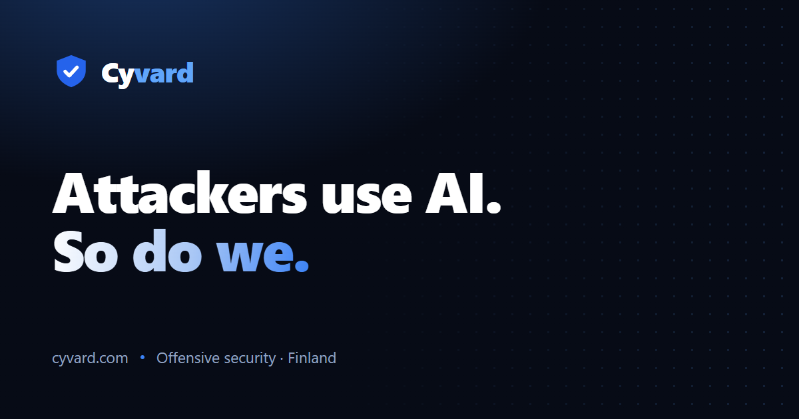

# Cyvard — website

Source for **[cyvard.com](https://cyvard.com)**, the site for Cyvard — offensive security for Finnish and EU companies.



A single-page marketing site built as a real React app: an interactive d3 orthographic globe with live "finding" pins, an English/Finnish toggle, scroll-reveal animations, a privacy-enhanced video embed, and a privacy policy — served from a Cloudflare Worker with a strict Content-Security-Policy.

## Stack

- **React 19** + **TypeScript** + **Vite**
- **Tailwind CSS v4** (`@tailwindcss/vite`, `@theme` design tokens)
- **Framer Motion** for scroll-reveal and micro-interactions
- **d3** (`geoOrthographic` / `geoPath` / `geoGraticule`) for the canvas globe, with HTML pins reprojected each frame
- **lucide-react** icons; `clsx` / `tailwind-merge` / `class-variance-authority`
- Deployed on **Cloudflare Workers** (static assets via `wrangler`)

## Develop

```bash
npm install
npm run dev      # local dev server (Vite + HMR)
npm run build    # tsc -b && vite build  -> dist/
npm run preview  # preview the production build
npm run lint     # oxlint
```

## Structure

```
src/
  App.tsx                 # sections: Hero, Threat, Services, Pricing, Track record, CTA, Privacy
  content.ts              # all copy, EN + FI (single source of truth for i18n)
  index.css               # Tailwind v4 theme tokens + utilities
  components/ui/
    wireframe-dotted-globe.tsx   # d3 orthographic globe + projected pins
public/                   # static assets (map data, images, favicon, robots, sitemap)
```

All site copy lives in `src/content.ts`, keyed by language (`en` / `fi`), so the whole site is translatable in one place.

## License

Code is provided as-is for reference. Brand assets, imagery, and copy are © Cyvard.
